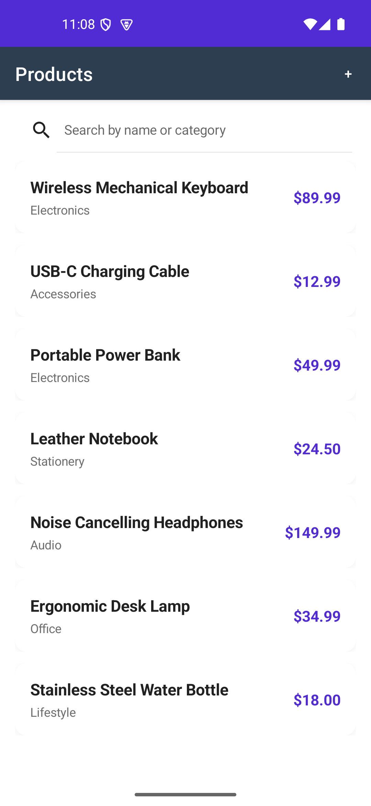
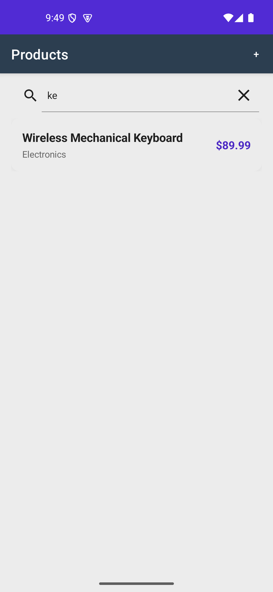
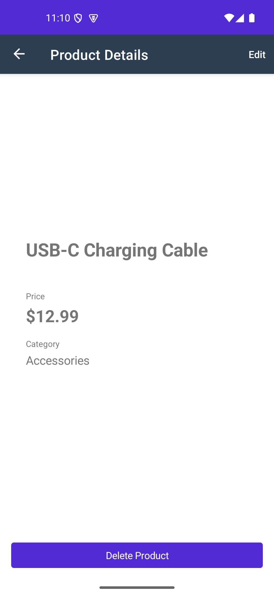
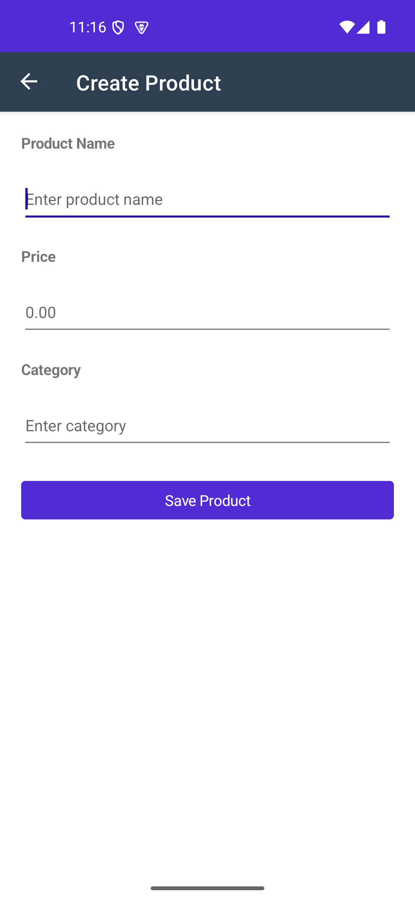
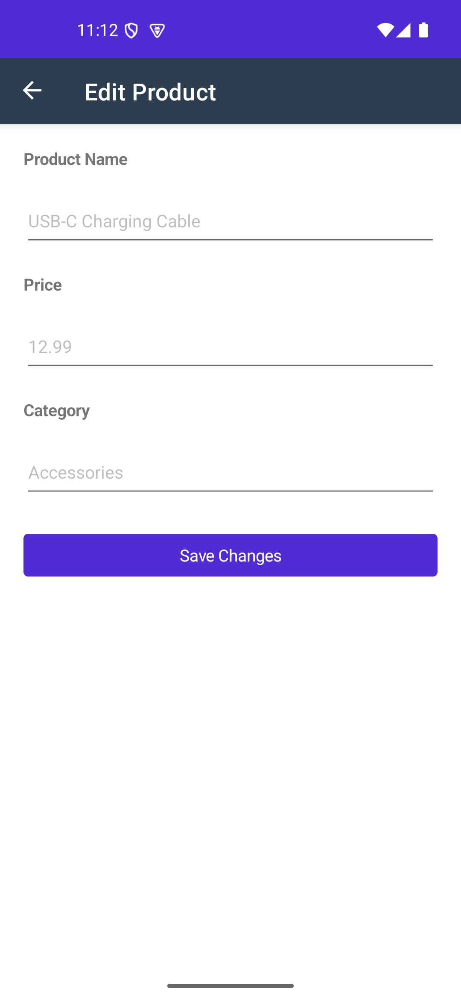
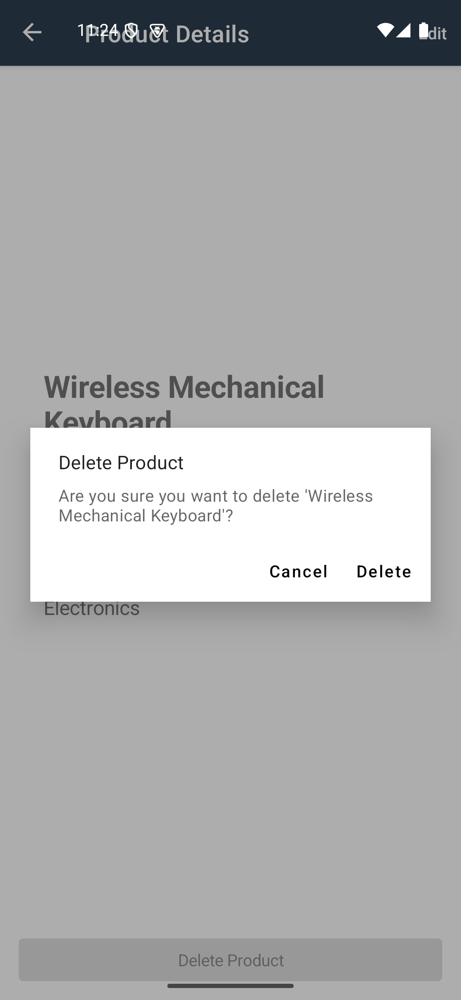

# Maui Product Manager

A full-stack Product Management application built with .NET MAUI and ASP.NET Core Web API, designed for learning and technical interview preparation.

The application allows users to manage a product catalog — viewing, searching, creating, editing, and deleting products — through a native Android mobile interface backed by a REST API.

## Screenshots

### Product List



### Search



### Product Detail



### Create Product



### Edit Product



### Delete Confirmation



## Features

- **Product CRUD** — Create, read, update, and delete products
- **Product Search** — Real-time filtering by name or category with 300ms debounce
- **Pull-to-Refresh** — Refresh the product list from the API
- **MVVM Architecture** — Clean separation of Views, ViewModels, and Services
- **Shell Navigation** — .NET MAUI Shell-based routing between pages
- **REST API Integration** — Full HTTP communication via HttpClient
- **Dependency Injection** — Services and ViewModels injected via constructor
- **Client-Side Validation** — Immediate feedback for required fields and price constraints
- **Server-Side Validation** — API enforces name, category, and price validation rules
- **Loading States** — Visual indicators during data fetches
- **Error Handling** — User-friendly error messages for network failures and HTTP errors
- **404 Handling** — Graceful handling when a product no longer exists
- **Swagger/OpenAPI** — Interactive API documentation at `/swagger`
- **Automated Tests** — xUnit tests for ViewModels, services, and controllers

## Architecture

```
MAUI App                          ASP.NET Core API
──────────────────────            ──────────────────────
View                               Controller
    │                                  │
    ▼                                  ▼
ViewModel                         Entity Framework Core
    │                                  │
    ▼                                  ▼
IProductService                   SQLite Database
    │
    ▼
ProductService
    │
    ▼
HttpClient ──────────────────────▶ ProductsController
```

**Views** display the UI and bind to ViewModels via data binding. They contain no business logic.

**ViewModels** manage UI state, handle user commands, and call services. They are injected via dependency injection.

**Services** encapsulate API communication. `ProductService` uses `HttpClient` to make HTTP requests to the backend. An `IProductService` interface allows for testing with a fake implementation.

**Controllers** handle incoming HTTP requests and delegate to Entity Framework Core for data access.

**DbContext** (`AppDbContext`) represents the database session and maps the `Product` entity to the SQLite database.

## Technology Stack

**Mobile (Frontend)**
- [.NET MAUI](https://dotnet.microsoft.com/apps/maui) 10.0.1
- [CommunityToolkit.Mvvm](https://learn.microsoft.com/dotnet/communitytoolkit/mvvm/) 8.3.2
- C# 13
- XAML

**Backend**
- [ASP.NET Core Web API](https://dotnet.microsoft.com/apps/aspnet/apis) (.NET 10.0)
- [Entity Framework Core](https://learn.microsoft.com/ef/core/) 10.0.0 with SQLite
- [Swashbuckle.AspNetCore](https://github.com/domaindrivendev/Swashbuckle.AspNetCore) (Swagger/OpenAPI) 6.9.0

**Testing**
- [xUnit](https://xunit.net/) 2.9.3
- [Microsoft.NET.Test.Sdk](https://github.com/microsoft/vstest) 17.14.1
- [Moq](https://github.com/moq/moq) 4.20.72
- [Microsoft.AspNetCore.Mvc.Testing](https://learn.microsoft.com/aspnet/core/test/integration-tests) 10.0.0
- [Microsoft.EntityFrameworkCore.InMemory](https://learn.microsoft.com/ef/core/miscellaneous/testing/in-memory) 10.0.0

## Project Structure

```
MauiProductManager.slnx
├── MauiProductManager/                    # .NET MAUI mobile app
│   ├── Models/
│   │   └── Product.cs                     # Product data model
│   ├── Views/
│   │   ├── ProductListPage.xaml(.cs)     # Main product list with search
│   │   ├── ProductDetailPage.xaml(.cs)    # Product details, edit, delete
│   │   ├── CreateProductPage.xaml(.cs)    # Create product form
│   │   └── EditProductPage.xaml(.cs)     # Edit product form
│   ├── ViewModels/
│   │   ├── ProductListViewModel.cs        # List state, search, refresh
│   │   ├── ProductDetailViewModel.cs      # Detail loading, delete
│   │   ├── CreateProductViewModel.cs      # Form validation, creation
│   │   ├── EditProductViewModel.cs        # Form validation, update
│   │   └── Messages.cs                    # MVVM messaging for cross-page updates
│   ├── Services/
│   │   ├── IProductService.cs             # Service interface
│   │   ├── ProductService.cs              # HttpClient-based API client
│   │   ├── InMemoryProductService.cs      # In-memory fallback (not used)
│   │   └── ProductValidationHelper.cs    # Shared validation logic
│   ├── Converters/
│   │   └── StringToBoolConverter.cs       # XAML value converter
│   ├── MauiProgram.cs                    # DI container setup
│   ├── App.xaml(.cs)                     # Application entry
│   ├── AppShell.xaml(.cs)                # Shell navigation routes
│   ├── MainPage.xaml(.cs)                # Windows desktop entry
│   └── appsettings.json                  # API base URL configuration
├── MauiProductManager.Api/                # ASP.NET Core Web API
│   ├── Controllers/
│   │   └── ProductsController.cs          # REST endpoints
│   ├── Models/
│   │   ├── Product.cs                     # Database entity
│   │   └── ProductDto.cs                  # Request/response DTO with validation
│   ├── Data/
│   │   └── AppDbContext.cs               # EF Core DbContext
│   ├── Migrations/                        # EF Core migrations
│   ├── Program.cs                         # App configuration and startup
│   └── appsettings.json                   # Database connection string
├── MauiProductManager.Tests/              # MAUI unit tests
│   ├── ViewModels/                        # ViewModel behavior tests
│   ├── Services/                          # Service and validation tests
│   └── Fakes/                             # Test doubles
├── MauiProductManager.Api.Tests/          # API unit tests
│   └── Controllers/
│       └── ProductsControllerTests.cs    # Controller integration tests
└── docs/
    ├── PRD.md                            # Product Requirements Document
    ├── api.md                            # API documentation
    └── android-local-development.md      # Android device setup guide
```

## Prerequisites

- [.NET 10.0 SDK](https://dotnet.microsoft.com/download/dotnet/10.0) or later
- Android SDK (for running the MAUI Android app)
- Android device or emulator (physical or virtual)
- Windows 10/11 for Android development

For iOS/macOS development, see the [.NET MAUI installation guide](https://learn.microsoft.com/dotnet/maui/get-started/installation).

## Running the Project

### 1. Clone the repository

```bash
git clone <repository-url>
cd "NET MAUI/Simple Application"
```

### 2. Start the ASP.NET Core API

```bash
cd MauiProductManager.Api
dotnet restore
dotnet run
```

On first run, the API automatically applies database migrations and creates `products.db` in the working directory. The API starts at `http://localhost:5000`.

Verify the API is running by opening `http://localhost:5000/swagger` in a browser.

### 3. Configure the MAUI API Base URL

The MAUI app reads its API base URL from `MauiProductManager/appsettings.json`.

By default, it is configured for the Android emulator:

```json
{
  "ApiBaseUrl": "http://10.0.2.2:5000"
}
```

`10.0.2.2` is the Android emulator's built-in alias for the host machine's `localhost`.

For a **physical Android device**, you must use your PC's LAN IP address. See [docs/android-local-development.md](docs/android-local-development.md) for the full setup steps including finding your IP address and configuring Windows Firewall.

For a **Windows desktop app**, the default `localhost:5000` works without changes.

### 4. Run the MAUI Application

```bash
cd MauiProductManager
dotnet build -t:Run -f net10.0-android
```

Or use your IDE's run configuration for the Android target.

## API Documentation

Swagger UI is available when the API is running in development mode:

```
http://localhost:5000/swagger
```

The Swagger UI provides an interactive interface to explore and test all endpoints.

Full API documentation is available at [docs/api.md](docs/api.md).

## Testing

Run all tests from the solution root:

```bash
dotnet test MauiProductManager.slnx
```

Run tests for a specific project:

```bash
# MAUI app tests (ViewModels, services, validation)
dotnet test MauiProductManager.Tests

# API tests (controller behavior)
dotnet test MauiProductManager.Api.Tests
```

## Design Decisions

### MVVM

The MAUI app uses the MVVM pattern because it cleanly separates UI from business logic. Views are purely declarative (XAML), ViewModels expose observable state and commands, and the data binding engine handles synchronization. This makes the app testable — ViewModels can be unit tested without a running UI — and keeps the Views free of business logic.

### Dependency Injection

Services and ViewModels are registered in `MauiProgram.cs` and injected via constructor. This means:

- Dependencies are explicit and immutable
- ViewModels can be unit tested with fake services
- The DI container manages the lifetime of `HttpClient` (registered as a singleton)

### HttpClient

HTTP communication stays inside `ProductService`. ViewModels never construct or use `HttpClient` directly. This keeps the network layer isolated — swapping `ProductService` for `InMemoryProductService` changes the data source without touching any ViewModel or View.

### SQLite

SQLite is the simplest choice for a local backend database in a learning project. It requires no separate server process, the database file is portable, and Entity Framework Core handles all schema management. For a production application, this would be replaced with a cloud database (e.g., PostgreSQL on Azure or AWS).

### Client-Side Search

Product search filters the in-memory collection returned from the API rather than sending a search request to the server. This keeps the UI responsive and works well for small datasets. For larger datasets, search should move server-side with a query parameter like `GET /api/products?search=keyboard`.

## Error Handling

The application handles errors at every layer:

- **Network failures** — `ProductService` catches `HttpRequestException` and surfaces a user-friendly message ("Unable to connect to the server")
- **HTTP 404** — `ProductDetailViewModel` detects a 404 and shows "The product could not be found"
- **HTTP 5xx** — Shows "Server error. Please try again later"
- **Other HTTP errors** — Shows "Unable to load product. Please try again"
- **Validation errors** — Client-side validation prevents invalid submissions; server validation returns structured error messages

The API returns consistent JSON error shapes:

```json
// Not found
{ "message": "Product with id 999 not found." }

// Validation failure
{ "Name": ["Name is required."], "Price": ["Price must be greater than zero."] }
```

## Validation

**Client-side**: The MAUI app validates form input before submission using `ProductValidationHelper`. Name and category must be non-empty; price must be greater than zero. Validation errors appear inline under each field.

**Server-side**: `ProductDto` uses Data Annotations (`[Required]`, `[StringLength]`, `[Range]`) to enforce:
- Name: required, max 100 characters
- Category: required, max 50 characters
- Price: required, greater than 0, at most 1,000,000

The API always validates input regardless of client-side validation.

## Limitations

- **No authentication** — The API is open and requires no API keys or tokens
- **No server-side search** — Search runs on the client against the full product list; not suitable for large datasets
- **SQLite database** — Data is stored locally; the API is designed for single-instance development use
- **Local development configuration** — The API base URL must be manually configured for physical Android devices
- **No pagination** — The API returns all products at once; the MAUI app loads the full list into memory

## Future Improvements

- User authentication and authorization
- Server-side search with pagination for scalability
- Cloud database deployment (e.g., PostgreSQL)
- Offline support with local data caching
- CI/CD pipeline for automated builds and tests
- Additional entity types (categories, orders)

## Documentation

- [docs/PRD.md](docs/PRD.md) — Product Requirements Document
- [docs/api.md](docs/api.md) — REST API reference
- [docs/android-local-development.md](docs/android-local-development.md) — Android device and emulator setup guide
